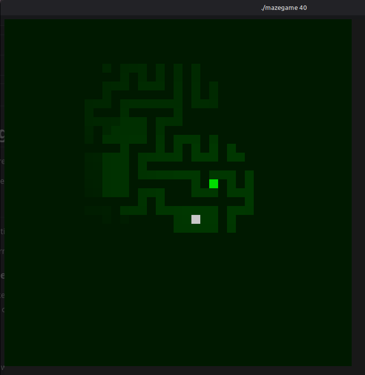

# Maze game
A game where you traverse a generated maze with limited vision.

The game uses escape code graphics in the terminal.

The goal of the game is to move the bright green dot (player) to the white dot (goal).  
The character (bright green dot) is moved with 'w', 'a' 's', 'd'. 

## Credits
Maze generation done with [mazegen.hpp](/mazegen.hpp) from [aleksandrbazhin/mazegen](https://github.com/aleksandrbazhin/mazegen/blob/master)

Capturing terminal input with function from [stackoverflow](https://stackoverflow.com/a/912796)

### Requirements:
* gnu make
* gcc (gnu c compiler)

### Set up:
1. Clone
2. Compile with "make"

Standard is 20x20 maze but can be changed with commandline arguments

### Running:
    
    ./mazegame [size] -[special_gamemode]
      size:
        size > 2
      special_gamemode:
        idle

### Game modes
The program has two modes. One where the player controls the character and one where the character searches the maze on their own.
